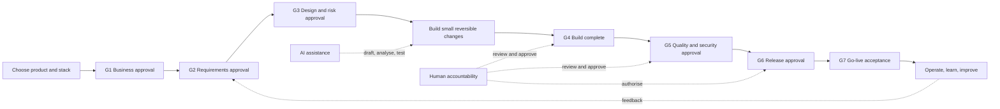

# SaaS Foundation

> Build a scalable product foundation with the right technology choices, an
> AI-enabled SDLC, and project context that keeps every developer on track.

[](LICENSE.md)
[](https://github.com/srksourabh/saas-foundation)

`saas-foundation` is an AI-agent skill for creating strong software foundations.
It does not blindly impose a fashionable stack. It begins with technology choices,
turns the chosen product direction into a documented engineering system, and
creates the code, controls, and operating context needed to build safely over time.

## Why use it

Most projects fail gradually: requirements become unclear, decisions disappear,
AI-generated code is trusted too quickly, security is added late, migrations are
unsafe, and nobody knows whether a release is ready. This skill makes those things
explicit from the first day.

It gives every project:

- A flexible technology decision, with a safe recommended starting point.
- A complete set of root context files that developers and AI agents read first.
- Risk-proportionate SDLC gates, evidence, independent review, and release controls.
- Security, privacy, test, migration, observability, deployment, and rollback rules.
- Small, reversible, traceable changes instead of uncontrolled complexity.

## The workflow



AI accelerates delivery; it does not replace accountability. AI output is treated
as untrusted until it has passed the relevant automated checks and independent
human review. An AI agent must not approve its own work, weaken a control, access
unapproved sensitive data, or independently authorise a material production change.

## Start with flexible technology choices

The skill opens with a technology-stack menu. Choose one option per relevant
layer, or say **"use your recommended stack"**. The recommendation is a starting
point, never a lock-in. Every selected choice and its rationale is recorded in
`ARCHITECTURE.md` and `DECISIONS.md`.

| Layer | Recommended starting point | Options you can choose |
|---|---|---|
| Project shape | Single TypeScript application or monorepo when justified | Single app, TypeScript monorepo, React SPA + API, backend/API only, mobile + API |
| Web framework | Next.js App Router | Next.js, React + Vite, Remix, Nuxt, SvelteKit, Astro, Angular |
| Backend/API | tRPC or route handlers | tRPC, REST/OpenAPI, Hono, Fastify, NestJS, Express, GraphQL, Django/FastAPI, Laravel, Rails, Go, .NET |
| Database | PostgreSQL | PostgreSQL, MySQL, SQLite/Turso, MongoDB, DynamoDB, Supabase, Neon, PlanetScale, Firebase/Firestore |
| Data access | Drizzle plus SQL migrations | Drizzle, Prisma, Kysely, SQLAlchemy, Django ORM, TypeORM, raw SQL |
| Authentication | Managed provider or Auth.js | Auth.js, Clerk, Better Auth, Supabase Auth, Firebase Auth, Auth0, Cognito, custom auth |
| UI system | Tailwind + shadcn/ui | Tailwind + shadcn/ui, Radix, MUI, Ant Design, Chakra, Mantine, Park UI, CSS Modules, Panda CSS, styled-components |
| State/data fetching | Server-first with React Query where needed | React Query, SWR, Zustand, Redux Toolkit, Jotai, server-first/RSC only |
| Hosting | Managed platform with least operational burden | Vercel, Cloudflare, Netlify, Railway, Render, Fly.io, AWS, GCP, Azure, DigitalOcean, Docker/Kubernetes |
| Background work | None until needed | BullMQ + Redis, Inngest, Trigger.dev, Temporal, Cloud Tasks, none |
| Storage | S3-compatible storage when needed | S3, Cloudflare R2, Supabase Storage, UploadThing, Firebase Storage, none |
| Email | Resend | Resend, Postmark, SendGrid, AWS SES, Plunk, none |
| Payments | Stripe | Stripe, Razorpay, Paddle, Lemon Squeezy, Adyen, none |
| Observability | Structured logs + error tracking | Sentry, OpenTelemetry, Datadog, Better Stack, Axiom, Highlight, none |
| Test stack | Vitest + Playwright | Vitest, Jest, Bun test; Playwright, Cypress, WebdriverIO; contract/load testing |
| Package manager | pnpm | pnpm, npm, yarn, Bun |

### Is Drizzle required?

No. Drizzle is a strong option for TypeScript and PostgreSQL teams that want
SQL-shaped code and direct control. Prisma, Kysely, SQL-first migrations, or a
managed data platform can be a better fit. What is mandatory is not an ORM; it is
a reviewed, version-controlled migration workflow, database constraints, backup
and restore testing, critical-query performance evidence, and a rollback or
forward-fix plan.

Read [the technology selection guide](reference/stack.md) before choosing a
database tool, a monorepo, queues, microservices, Docker, or any additional service.

## Files created in every project

These root-level files are created for a new project. For an existing project,
the skill reads each file first, preserves valuable content, and normalises its
structure instead of overwriting it with generic text.

| File | Why it exists |
|---|---|
| `README.md` | Product overview, selected stack, quick start, and document map |
| `AGENTS.md` | Non-negotiable developer/AI rules, commands, Definition of Ready and Done |
| `PRODUCT.md` | Problem, users, scope, non-goals, success metrics, first milestone |
| `REQUIREMENTS.md` | Prioritised requirements, acceptance criteria, non-functional needs, traceability |
| `ARCHITECTURE.md` | System boundaries, selected stack, data flow, trade-offs, operational qualities |
| `DESIGN.md` | User journeys, visual/interaction rules, accessibility, responsive states |
| `SECURITY.md` | Data classification, auth, authorisation, threats, privacy, AI safeguards, incident readiness |
| `DATABASE.md` | Data model, ownership, migrations, tenancy, access, backups, retention |
| `API.md` | Interface contracts, versioning, auth, errors, idempotency, compatibility |
| `TESTING.md` | Test strategy, commands, coverage, independent evidence, release gates |
| `DEPLOYMENT.md` | Environments, CI/CD, rollout, stop conditions, smoke checks, rollback |
| `DECISIONS.md` | ADR-style decision log, alternatives, risk class, stage gates, exceptions |
| `PROGRESS.md` | Current plan, next actions, blockers, accountable owners, G1-G7 evidence |
| `CHANGELOG.md` | User-facing release history with an Unreleased section |

The skill also creates an AI-platform configuration appropriate to the tool you use:

| Your AI platform | Extra generated file(s) |
|---|---|
| Claude Code, Cursor, or Windsurf | `CLAUDE.md` |
| OpenClaw or Hermes | `soul.md` and `user.md` |
| Codex or Anti-Gravity | `agent.md` |
| Generic agent | `CLAUDE.md` and `agent.md` |

## Built-in engineering controls

### Risk classification

Controls grow with real risk, not process theatre.

| Class | Example | Minimum control level |
|---|---|---|
| A - Critical | Payments, regulated/sensitive data, safety, core operations | Independent security, privacy, resilience, and performance assurance; controlled release and enhanced monitoring |
| B - Significant | Customer-facing service or material data/availability dependency | Comprehensive functional and risk-based non-functional evidence; protected pipeline and rollback |
| C - Standard | Normal product increment or bounded internal application | Automated tests, peer review, risk checks, smoke test |
| D - Experimental | Isolated prototype with no sensitive/customer production use | Basic validation and explicit limitations; no production use until reclassified |

### Definition of Ready

Before implementation: the business reason, owner, scope, acceptance criteria,
roles, data/security/privacy constraints, dependencies, risk class, validation
plan, AI limits, and independent reviewer are known.

### Definition of Done

Before completion: every acceptance criterion has evidence; the diff is focused;
required review and checks pass; risks/exceptions are approved and recorded; and
documentation, traceability, deployment/rollback, monitoring, and ownership are
updated proportionately.

For the full operating model, read [AI-enabled SDLC baseline](reference/ai-enabled-sdlc.md).

## Install

### One command

macOS, Linux, WSL, or Git Bash:

```bash
curl -fsSL https://raw.githubusercontent.com/srksourabh/saas-foundation/main/skills.sh | bash
```

The installer detects supported AI tool directories and installs the skill into
each available location.

### Manual installation

```bash
git clone https://github.com/srksourabh/saas-foundation.git
cp -R saas-foundation ~/.claude/skills/saas-foundation
```

Use your AI tool's equivalent skill directory when it differs.

### Update an existing installation

Installed copies do **not** update automatically. Re-run the one-command
installer above to replace the existing local skill with the latest `main` branch.
New installations always use the current published version.

## Use it

After installation, open your AI agent and ask in plain language:

```text
Create a scalable SaaS foundation called ledgerly. Start with technology stack options.
```

Or provide your choices directly:

```text
Create a B-significant customer portal called northstar.
Use Next.js, PostgreSQL, Prisma, Clerk, REST/OpenAPI, MUI, Playwright,
AWS, and GitHub Actions. Create the full operating context and do not add
Redis or microservices unless a requirement proves they are needed.
```

For an existing codebase:

```text
Use saas-foundation to normalise the project context files for this repository.
Preserve existing information, classify the risk, identify gaps as TBD, and do
not change application behaviour.
```

## What a developer follows for every material change

1. Understand the requirement, business value, architecture, risk, and acceptance criteria.
2. Classify security, privacy, data, financial, regulatory, availability, and AI risk.
3. Plan a small coherent change with tests, documentation, migration, and rollback impact.
4. Implement using only approved context, data, tools, and access.
5. Run the required checks; inspect the diff and evidence.
6. Obtain independent review; correct findings and re-verify.
7. Release through the approved pipeline with rollbacks, smoke tests, monitoring, and ownership.
8. Feed outcomes, incidents, and lessons back into requirements and decisions.

## Repository map

```text
saas-foundation/
├── SKILL.md                    # Instructions read by the AI agent
├── skills.sh                   # Cross-tool installer and updater
├── reference/
│   ├── ai-enabled-sdlc.md      # Risk classes, gates, evidence, AI controls
│   ├── stack.md                # Technology and ORM selection guide
│   ├── design-guide.md         # Design-system implementation guidance
│   ├── project-structure.md    # TypeScript profile reference
│   └── security-checklist.md   # Security checklist
├── templates/
│   ├── context/                # The 14 mandatory root context templates
│   ├── CLAUDE.md               # Claude/Cursor/Windsurf context
│   ├── agent.md                # Codex/Anti-Gravity context
│   ├── soul.md + user.md       # OpenClaw/Hermes context
│   └── ...                     # Legacy compatibility templates
└── scripts/scaffold.ps1        # Optional TypeScript profile generators
```

## Scope

Use this skill for a new product foundation or for safely normalising project
context in an existing repository. It does not invent a business domain, replace
human accountability, or change existing application behaviour while performing a
context-only upgrade.

## License

[MIT](LICENSE.md)
