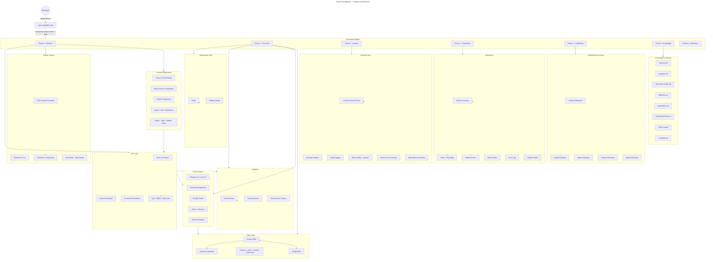
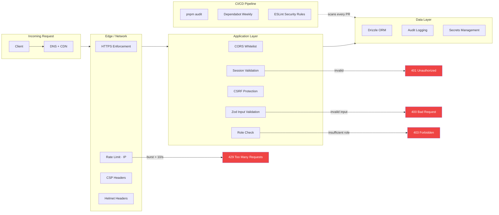

# SaaS Foundation

> The world's best full-stack TypeScript SaaS foundation — scaffolded, secured, and documented in one command.

[](LICENSE.md)
[](https://github.com/srksourabh/saas-foundation)

**saas-foundation** is a Claude Code skill (compatible with any AI agent tool that supports Claude skills) that generates a complete, production-grade SaaS starter project from scratch. It is not a template you clone — it is an **intelligent scaffolder** that starts by offering a broad technology-stack menu, then builds the project and its operating context for you.

When invoked, it creates your project in seconds, not hours.

---

## Table of Contents

- [What it generates](#what-it-generates)
- [Architecture](#architecture)
- [How the skill works](#how-the-skill-works)
  - [What it looks for (triggers)](#what-it-looks-for-triggers)
  - [Pre-flight questions](#pre-flight-questions)
  - [Generation process (6 phases)](#generation-process-6-phases)
- [Component inventory](#component-inventory)
  - [Core files](#core-files)
  - [Templates (project output)](#templates-project-output)
  - [Reference docs](#reference-docs)
  - [Scaffolding scripts](#scaffolding-scripts)
- [Installation](#installation)
  - [Quick install (one-command)](#quick-install-one-command)
  - [Claude Code CLI](#claude-code-cli)
  - [Manual installation](#manual-installation)
  - [OpenClaw](#openclaw)
  - [Cursor](#cursor)
  - [VS Code (Claude extension)](#vs-code-claude-extension)
  - [Windsurf](#windsurf)
- [Usage](#usage)
- [What each template produces](#what-each-template-produces)
- [Extending the foundation](#extending-the-foundation)
- [Stack decisions](#stack-decisions)
- [Security model](#security-model)
- [License](#license)

---

## What it generates

### Mandatory project context

Every generated project includes these root-level files, ready for immediate use:

| File | Purpose |
|---|---|
| `README.md` | Overview, selected stack, quick start, and document map |
| `AGENTS.md` | Rules and commands for AI agents and contributors |
| `PRODUCT.md` / `REQUIREMENTS.md` | Product direction and accepted build contract |
| `ARCHITECTURE.md` / `DESIGN.md` / `SECURITY.md` | Technical, UX, and safety blueprint |
| `DATABASE.md` / `API.md` / `TESTING.md` | Data, interface, and quality contracts |
| `DEPLOYMENT.md` | Environments, release, smoke-check, and rollback runbook |
| `DECISIONS.md` / `PROGRESS.md` / `CHANGELOG.md` | Decisions, active work, and release history |

For an existing project, the skill preserves useful content and restructures these files into the standard format instead of replacing them wholesale.

```
<project-name>/
├── apps/
│   └── web/                    # Next.js 16 (App Router)
│       ├── app/
│       │   ├── (auth)/         # Login, signup pages
│       │   ├── (dashboard)/    # Authenticated shell
│       │   ├── api/            # tRPC handler, auth handler
│       │   ├── layout.tsx      # Root layout with providers
│       │   └── page.tsx        # Landing page
│       ├── components/         # UI components
│       ├── trpc/               # tRPC router definitions
│       ├── e2e/                # Playwright tests
│       └── middleware.ts       # Security headers, rate limiting
├── packages/
│   ├── ui/                     # shadcn/ui components
│   ├── db/                     # Drizzle schema + migrations
│   ├── auth/                   # Auth configuration
│   ├── validators/             # Zod validation schemas
│   ├── email/                  # React Email templates
│   └── config/                 # Env vars, constants, errors, logger
├── tooling/
│   ├── eslint/                 # Shared ESLint flat config
│   └── typescript/             # Shared tsconfig bases
├── scripts/                    # Scaffolding CLI
├── .github/workflows/          # CI/CD pipelines
├── docker/
│   ├── Dockerfile
│   └── docker-compose.yml      # Postgres + Redis + app
├── docs/
│   ├── memory.md               # Session-level context
│   ├── progress.md             # Milestone tracking
│   ├── ARCHITECTURE.md         # System design
│   ├── DESIGN.md               # Design system tokens
│   ├── SECURITY.md             # Security model
│   ├── CONTRIBUTING.md         # Contributor guide
│   └── ADR/                    # Architecture Decision Records
├── CLAUDE.md                   # Per-project AI instructions
├── .env.example                # Environment variable template
├── .gitignore
├── package.json                # pnpm workspace root
├── pnpm-workspace.yaml
├── turbo.json
├── tsconfig.json
├── vitest.workspace.ts
└── playwright.config.ts
```

---

## Architecture



---

## How the skill works

### What it looks for (triggers)

The skill auto-fires when you say any of these phrases:

| Trigger phrase | Example |
|----------------|---------|
| Create a new project | "create a new project called acme" |
| Start a new SaaS | "start a new SaaS called myapp" |
| Scaffold a project | "scaffold a full-stack TypeScript SaaS" |
| Project foundation | "use the project foundation" |
| World's best foundation | "use the world's best foundation" |
| Build a new app | "build a new app with auth and DB" |
| Initialize foundation | "initialize foundation for my startup" |
| New full-stack project | "new full-stack project with monorepo" |
| Start a monorepo | "start a monorepo project" |

### Default choices vs alternatives

This foundation uses **sensible defaults** for every layer. If you want something different,
just say so — the skill substitutes the alternative and the architecture stays the same.

| Layer | Default | Alternatives you can request |
|-------|---------|------------------------------|
| **UI library** | shadcn/ui (Radix + Tailwind) | Radix Primitives, MUI, Ant Design, Chakra, Park UI |
| **API layer** | tRPC v11 (end-to-end typesafe) | Hono, plain Next.js API Routes, Express, Fastify |
| **Auth** | NextAuth v5 | Lucia v3, Clerk, Auth0, Supabase Auth |
| **Database ORM** | Drizzle ORM | Prisma, Kysely, TypeORM |
| **CSS** | Tailwind CSS v4 | Panda CSS, vanilla CSS modules, styled-components |
| **Package manager** | pnpm | npm, yarn, bun |
| **AI platform** | Claude Code | OpenClaw / Hermes, Codex, Anti-Gravity, Cursor, Windsurf |

Each AI platform gets its own agent configuration file(s):

| Platform | File(s) generated | Purpose |
|----------|-------------------|---------|
| Claude Code (default) | `CLAUDE.md` | Stack, commands, conventions, security rules |
| OpenClaw / Hermes | `soul.md` + `user.md` | Agent identity + user preferences |
| Codex / Anti-Gravity | `agent.md` | Agent behavior, tools, security checklist |
| Cursor / Windsurf | `CLAUDE.md` | Same as Claude Code |
| Generic / any LLM | `CLAUDE.md` + `agent.md` | Maximum compatibility |

**Examples of alternative requests:**

```
"create a project called acme with MUI instead of shadcn"
"scaffold a SaaS using Hono for the API layer"
"start a new project with Prisma instead of Drizzle"
"build a foundation with Chakra UI and Express backend"
```

### Pre-flight questions

Before generating, the skill asks a few questions. Omit any that don't apply — the skill
uses the default:

1. **Project name** — kebab-case, e.g., `my-saas`
2. **UI library** — shadcn/ui (default), Radix Primitives, MUI, Chakra, or something else?
3. **API layer** — tRPC (default), Hono, or plain Next.js API Routes?
4. **Auth provider** — NextAuth v5 (default), Lucia v3, or something else?
5. **AI platform** — Claude Code (default), OpenClaw / Hermes, Codex, Anti-Gravity, Cursor, Windsurf, or generic?

If you say "surprise me" or "your call" on any question, the skill uses the default.
The AI platform answer determines which agent configuration files are generated:
Claude Code gets `CLAUDE.md`, OpenClaw/Hermes get `soul.md` + `user.md`,
Codex/Anti-Gravity get `agent.md`, and generic gets both `CLAUDE.md` + `agent.md`.

### Generation process (6 phases)

| Phase | What happens | Output |
|-------|-------------|--------|
| **0 — Skeleton** | Creates directory structure, root configs (turborepo, pnpm, tsconfig, vitest, playwright) | ~60 directories, ~20 config files |
| **1 — Core infra** | Drizzle schema (users/sessions/audit_logs), auth, Zod validators, tRPC router (or Hono/API Routes if requested), Next.js pages, Docker Compose, design system, shadcn/ui (or alternative UI library if requested) | ~80 files across all packages |
| **2 — Security** | CSP + Helmet headers, CORS, rate limiting, RBAC middleware, audit logging, brute force protection, password policy | middleware.ts, config, audit schema |
| **3 — Operations** | Vitest tests, Playwright E2E, Pino logging, Sentry integration, health checks, CI/CD YAML | ~15 test files, CI pipeline |
| **4 — Scaffolding** | CLI scripts for generating models, pages, features, and emails | scripts/scaffold.ps1 |
| **5 — Knowledge** | Universal docs + platform-specific agent config (CLAUDE.md for Claude/Cursor, soul.md+user.md for OpenClaw/Hermes, agent.md for Codex/Anti-Gravity) | 8+ universal files + 1-2 platform config files |
| **6 — Verification** | 11-point checklist: install, lint, typecheck, test, docker build, health endpoint, auth flow | Pass/fail on each check |

---

## Component inventory

### Core files

| File | Purpose |
|------|---------|
| `SKILL.md` | Main skill definition — 406 lines of instructions covering 6 execution phases, anti-patterns, output format, and scope boundary. This is what the AI agent reads when the skill is invoked. |
| `skills.sh` | One-command installer — auto-detects Claude Code, OpenClaw, Cursor, Windsurf, and VS Code Claude extension, installs the skill into each, and verifies. |
| `LICENSE.md` | MIT License — full terms for open-source use, modification, and distribution. |
| `.gitignore` | Excludes `node_modules/`, `.DS_Store`, `Thumbs.db`, and `*.log`. |

### Templates (project output)

These are the files the skill writes **into your generated project**. Each template contains `<placeholders>` that get replaced with your project name, auth provider, and current year.

#### Knowledge continuity

| Template | Generates in project | Purpose |
|----------|---------------------|---------|
| `templates/CLAUDE.md` | `CLAUDE.md` | Per-project AI instructions. Tells the AI agent the stack, conventions, commands, and security rules for that specific project. Ensures every AI session has the correct context. |
| `templates/memory.md` | `docs/memory.md` | Session-level context store. Records project metadata, architecture decisions (with ADR links), key dependencies, session notes (date-stamped), known issues, and environment details (dev/staging/prod). Updated each session. |
| `templates/progress.md` | `docs/progress.md` | Milestone tracker. Contains Phase 0-6 checklists (all marked pending on creation), a completed log table, and a blockers table. Serves as the single source of truth for what's done and what's next. |
| `templates/ARCHITECTURE.md` | `docs/ARCHITECTURE.md` | System architecture document. Includes ASCII system overview diagram, request flow explanation, data model definitions (users, sessions, audit_logs), security boundary table, and package dependency graph. |
| `templates/DESIGN.md` | `docs/DESIGN.md` | Complete design system specification. Brand palette (50-900 scale), semantic colors (light + dark), typography (type scale with Inter + JetBrains Mono), spacing scale, border radius tokens, shadow tokens, motion tokens, layout system (sidebar + main + breakpoints), component tier architecture (primitives → composed → feature), state patterns (loading/empty/error/edge), form patterns (react-hook-form + Zod), accessibility baseline (WCAG AA), dark mode implementation, iconography conventions, and coding conventions for UI. |
| `templates/SECURITY.md` | `docs/SECURITY.md` | Security model document. Covers authentication method, RBAC roles, rate limits, CSP/Helmet headers, data protection (SQL injection, XSS, secrets), audit logging policy, dependency security, and incident response procedures. |
| `templates/CONTRIBUTING.md` | `docs/CONTRIBUTING.md` | Onboarding and contribution guide. Step-by-step setup instructions, development workflow (branch → code → test → lint → typecheck → build → commit → PR), code conventions (naming, imports, exports), testing conventions, and a pull request checklist. |
| `templates/ADR-template.md` | `docs/ADR/adr-template.md` | Architecture Decision Record template. Each ADR captures: date, status (Proposed/Accepted/Deprecated/Superseded), context, decision, rationale, trade-offs, and consequences. Promotes "decisions are documented" culture from day one. |

#### Platform-specific agent config (one set per project)

| Template | Generated when platform is... | Purpose |
|----------|------------------------------|---------|
| `templates/CLAUDE.md` | Claude Code, Cursor, Windsurf, or generic | Per-project AI instructions. Stack, commands, conventions, security rules. |
| `templates/soul.md` | OpenClaw / Hermes | Agent identity, core principles, decision-making framework, session ritual. Defines *who the agent is* and *how it thinks*. |
| `templates/user.md` | OpenClaw / Hermes | User profile, communication preferences, expertise areas, project context. Defines *who the user is* and *how they want to interact*. |
| `templates/agent.md` | Codex, Anti-Gravity, or generic | Agent behavioral guidelines, tool access, code standards, security checklist, knowledge continuity rules. |

#### Configuration

| Template | Generates in project | Purpose |
|----------|---------------------|---------|
| `templates/.env.example` | `.env.example` | Environment variable stencil. Documents every env var required: database URL, auth secret, OAuth credentials, Redis URL, Resend API key, Upstash credentials, Sentry DSN, and app URL. All values are placeholders — no real secrets. |

### Reference docs

These live in the skill itself and guide the AI agent during generation:

| File | Purpose |
|------|---------|
| `reference/stack.md` | Technology choice rationale. Explains why each library was chosen vs alternatives (e.g., Turborepo over Nx, Drizzle over Prisma, Vitest over Jest). Includes "when to swap" guidance for serverless DB, file uploads, real-time, AI features, and multi-tenancy. |
| `reference/project-structure.md` | Directory tree reference with every file enumerated. Includes the package alias map (`@ui`, `@db`, `@auth`, `@validators`, `@email`, `@config`) showing how imports resolve across the monorepo. |
| `reference/design-guide.md` | Front-end design implementation roadmap. Provides step-by-step generation order: globals CSS → Tailwind config → shadcn/ui init → layout components → page layouts → responsive behavior. Includes DataTable and form page composition patterns with code examples. Documents 8 anti-patterns the agent must avoid. |
| `reference/security-checklist.md` | 45-point security hardening checklist organized by category: auth (7 checks), API (6 checks), HTTP headers (6 checks), database (4 checks), secrets (4 checks), monitoring (5 checks). Each check is represented as a `[ ]` checkbox the agent ticks during Phase 2. |

### Scaffolding scripts

| File | Purpose |
|------|---------|
| `scripts/scaffold.ps1` | PowerShell scaffolding CLI that gets copied into the generated project as `scripts/scaffold.ps1`. Supports four commands via `pnpm scaffold`: |

| Command | Generates |
|---------|-----------|
| `pnpm scaffold model <name>` | Drizzle schema file, Zod validator (create + update schemas), and tRPC CRUD router (list/getById/create/update/delete) |
| `pnpm scaffold page <name>` | Next.js page (`page.tsx`), error boundary (`error.tsx`), and loading state (`loading.tsx`) |
| `pnpm scaffold feature <name>` | Full vertical slice: model + page + API + tests |
| `pnpm scaffold email <name>` | React Email template file |

---

## Installation

### Quick install (one-command)

```bash
curl -fsSL https://raw.githubusercontent.com/srksourabh/saas-foundation/main/skills.sh | bash
```

This auto-detects your installed AI tools and installs the skill into each one.

### Claude Code CLI

```bash
# Clone directly into Claude Code skills directory
git clone https://github.com/srksourabh/saas-foundation ~/.claude/skills/saas-foundation

# Or add as a submodule if your skills directory is a repo
cd ~/.claude/skills
git submodule add https://github.com/srksourabh/saas-foundation
```

### Manual installation

```bash
# Download the ZIP
curl -fsSL https://github.com/srksourabh/saas-foundation/archive/refs/heads/main.zip -o saas-foundation.zip
unzip saas-foundation.zip
mv saas-foundation-main ~/.claude/skills/saas-foundation
rm saas-foundation.zip
```

### OpenClaw

OpenClaw runs skills from `~/.openclaw/skills/` (mounted via Docker volume in `openclaw-docker/docker-compose.yml`).

```bash
# 1. Create the skills directory
mkdir -p ~/.openclaw/skills

# 2. Install the skill
git clone https://github.com/srksourabh/saas-foundation ~/.openclaw/skills/saas-foundation

# 3. Set the environment variable (if not already set)
echo "OPENCLAW_SKILLS_DIR=$HOME/.openclaw/skills" >> ~/.openclaw/.env

# 4. Restart the OpenClaw container
cd ~/openclaw-docker
docker compose restart
```

OpenClaw also supports the `.claude/skills/` directory if mounted at `/home/node/.claude/skills` inside the container. The `skills.sh` installer handles both paths.

### Cursor

Cursor supports Claude-compatible skills at `~/.cursor/claude/skills/`:

```bash
mkdir -p ~/.cursor/claude/skills
git clone https://github.com/srksourabh/saas-foundation ~/.cursor/claude/skills/saas-foundation
```

### VS Code (Claude extension)

The Claude extension for VS Code reads skills from `~/.vscode/claude/skills/`:

```bash
mkdir -p ~/.vscode/claude/skills
git clone https://github.com/srksourabh/saas-foundation ~/.vscode/claude/skills/saas-foundation
```

### Windsurf

```bash
mkdir -p ~/.windsurf/claude/skills
git clone https://github.com/srksourabh/saas-foundation ~/.windsurf/claude/skills/saas-foundation
```

---

## Usage

Once installed, open your AI agent tool and use one of the trigger phrases:

```
create a new project called my-saas
```

The agent will:
1. Ask for your project name and choices (omit any for defaults)
2. Generate the entire project structure with your chosen stack
3. Write every file from templates
4. Run verification checks
5. Return a summary with next steps

### Example session (all defaults)

```
You:  create a new project called acme
Agent: Questions:
       1. Project name: acme (pre-filled)
       2. UI library: shadcn/ui (default) or something else?
       3. API layer: tRPC (default) or Hono or API Routes?
       4. Auth provider: NextAuth v5 (default) or Lucia v3?
You:  all defaults
Agent: [generates project... returns:]

      ## Project created: acme

      ### Structure
      - 42 directories, 127 files

      ### Stack
      - Frontend: Next.js 16 + Tailwind + shadcn/ui
      - Design system: token-based, Inter + JetBrains Mono, WCAG AA
      - Backend: tRPC + Drizzle ORM + PostgreSQL
      - Auth: NextAuth v5 (Google + email/password)
      - Queue: BullMQ + Redis
      - Test: Vitest + Playwright
      - CI: GitHub Actions
```

### Example session (with alternatives)

```
You:  scaffold a project called dashbird with MUI and Hono
Agent: Questions:
       1. Project name: dashbird (pre-filled)
       2. UI library: MUI (pre-filled from your request)
       3. API layer: Hono (pre-filled from your request)
       4. Auth provider: NextAuth v5 (default)
You:  looks good
Agent: [generates project with MUI components and Hono API routes]
```

You can mention your preferences directly in the trigger phrase — the skill
understands and fills them in without asking.

---

## Quick start (once generated)

```bash
cd <project-name>
cp .env.example .env   # fill in database URL, auth secret, OAuth keys
docker compose up -d   # starts Postgres + Redis
pnpm install
pnpm db:push           # push Drizzle schema to database
pnpm dev               # start development server
```

---

## What each generated file is for

Below is a detailed breakdown of every `.md` file the foundation generates in your
project — what it contains, who uses it, when to update it, and why it matters.

---

### `CLAUDE.md` — Per-project AI agent instructions

**What it is**: The instruction manual for any AI agent working on your project.
Claude Code, Cursor, and other AI tools read this file at session start to
understand the project's stack, conventions, and security rules.

**What it contains**:
- Project type declaration (Full-stack TypeScript SaaS)
- Exact stack listing (every framework and library with versions)
- All available commands (`pnpm dev`, `pnpm build`, `pnpm test`, `pnpm db:push`, etc.)
- Directory structure map (where files live across the monorepo)
- Code conventions (naming, imports, exports, error handling)
- Security rules the agent must follow (validate input, check auth, never log PII)

**Who uses it**: AI agents (Claude Code, Cursor, Windsurf, OpenClaw) on every session.
Humans rarely need to read it — it works in the background.

**When to update**: When you add a new command, change a convention, add a dependency,
or modify the security rules. The agent references it automatically.

**Why it matters**: Without `CLAUDE.md`, every AI session starts with zero context.
The agent must guess your stack, ask repetitive questions, and may violate conventions.
This file eliminates that friction entirely. One source of truth for every AI interaction.

---

### `docs/memory.md` — Session-level context & decision log

**What it is**: A living document that records project metadata, every architectural
decision made (with links to ADRs), session-by-session notes, known issues, and
environment details. It is the project's collective memory — for both humans and AI.

**What it contains** (full template at `templates/memory.md`):
- **Project metadata**: creation date, stack summary, auth provider, deployment targets (dev/staging/prod URLs)
- **Architecture decisions**: chronologically ordered ADR references with date, decision, reason, and trade-offs for each significant choice made
- **Key dependencies**: every major library with a one-line description of what it does
- **Session notes**: date-stamped entries in `### YYYY-MM-DD: Title` format, recording:
  - What was worked on during the session
  - Key decisions made (with links to files)
  - Files touched or created
  - Current state or blockers encountered
  - Next steps for the following session
- **Known issues**: running log of bugs, pending decisions, and tech debt with status
- **Environment**: connection details for dev (Docker Compose), staging, and production

**Who uses it**: Both humans and AI agents. At the start of every session, the AI
reads `memory.md` to catch up on what happened previously. Humans read it to review
project history or onboard new team members.

**When to update**: At the end of every work session. The AI agent (or human) adds a
new session note entry with date, work done, decisions made, and current state.
New architecture decisions get an ADR reference added. New bugs or issues get added
to the known issues section.

**Usage example**:
```markdown
### 2026-07-12: Implemented authentication flow
- Set up NextAuth v5 with Google OAuth provider
- Created login page at `app/(auth)/login/page.tsx`
- Added session validation middleware
- Blocked: need Google API credentials from admin
- Next: wire up signup form and email verification
```

**Why it matters**: Without a memory file, context dies with every session. The AI
forgets what it built yesterday, decisions get remade (possibly with different
outcomes), and blockers go unresolved. `memory.md` is the thread that connects every
session into a coherent development process.

---

### `docs/progress.md` — Milestone & task tracker

**What it is**: A structured checklist that tracks the foundation build process and
any subsequent development milestones. It is the single source of truth for "what's
done, what's next, what's blocked."

**What it contains** (full template at `templates/progress.md`):
- **Phase 0-6 checklists**: Every step required to complete the foundation, organized
  by phase. All items start as `[ ]` (pending) and get checked off as completed.
  - Phase 0: Directory structure, root configs, .gitignore
  - Phase 1: Database schema, auth, tRPC, validators, config, web app, Docker, design system, UI
  - Phase 2: CSP, Helmet, CORS, rate limiting, RBAC, audit logging, session rotation
  - Phase 3: Tests, logging, error handling, health checks, CI/CD
  - Phase 4: Scaffolding scripts (model, page, feature, email generators)
  - Phase 5: Knowledge files (CLAUDE.md, memory.md, progress.md, ARCHITECTURE.md, DESIGN.md, SECURITY.md, CONTRIBUTING.md, ADR/)
  - Phase 6: Final verification (install, lint, typecheck, test, Docker build, health endpoint, auth flow)
- **Completed table**: Date-stamped log of completed milestones with notes
- **Blockers table**: Table of unresolved blockers with date, description, and status

**Who uses it**: Project leads, developers, and AI agents. The AI reads it at session
start to know where work left off. Humans use it for standups, sprint planning, and
status reports.

**When to update**: Whenever a task is completed or a blocker arises. The AI agent
ticks checkboxes as it finishes work. Humans add rows to the blockers table when
something is stuck.

**Usage example**:
```markdown
## Completed

| Date       | Milestone        | Notes                    |
|------------|------------------|--------------------------|
| 2026-07-12 | Phase 1 — Core   | Auth + DB + API complete |

## Blockers

| Date       | Blocker                    | Status    |
|------------|----------------------------|-----------|
| 2026-07-12 | Need Google OAuth keys     | unresolved|
```

**Why it matters**: Without progress tracking, you have no answer to "where are we?"
The AI can't prioritize what to work on next, tasks fall through cracks, and blockers
stay blocked. `progress.md` turns ambiguity into a clear checklist.

---

### `docs/ARCHITECTURE.md` — System design reference

**What it is**: The authoritative document for how the system is built, how data
flows, and how components connect. The architectural blueprint of your application.

**What it contains** (full template at `templates/ARCHITECTURE.md`):
- **ASCII system diagram**: Text-based visual showing the flow from Next.js (App Router)
  through tRPC to Drizzle ORM / PostgreSQL, with Redis for queue and rate limiting
- **Request flow**: Step-by-step walkthrough of how a browser request reaches the database
  and returns — from RSC/client component through tRPC context, validation, auth check,
  and query execution
- **Data model**: Complete definitions for every database table:
  - `users` — id (UUID), email (unique, indexed), name, avatar_url, role (admin/user/viewer),
    created_at, updated_at
  - `sessions` — id (UUID), user_id (FK -> users), expires_at, created_at
  - `audit_logs` — id (UUID), user_id (FK, nullable), action, resource, details (JSONB),
    ip_address, created_at
- **Security boundaries**: Table mapping each layer (network, transport, application,
  auth, data) to its protection mechanism
- **Package dependency graph**: Visual map showing `apps/web` depending on each package
  and each package's internal dependencies

**Who uses it**: Developers onboarding to the project, AI agents reasoning about
architecture, and architects reviewing design decisions. Updated when the architecture
changes significantly.

**When to update**: When you add a new service, change the data flow, modify the
database schema, or alter the security architecture. Infrequent but critical.

**Why it matters**: Without an architecture document, every developer and AI agent
must reverse-engineer the system from code. This document provides the "big picture"
that code alone cannot convey — enabling faster onboarding and better architectural
decisions.

---

### `docs/DESIGN.md` — Design system & UI conventions

**What it is**: The complete design token specification and UI coding conventions
for the project. Ensures visual consistency across every page and component.

**What it contains** (full template at `templates/DESIGN.md`):
- **Brand palette**: Tokenized color scale (50-900) with hex values and usage
  descriptions (e.g., `--color-brand-500` = primary buttons)
- **Semantic colors**: Light and dark mode values for background, text, borders,
  success/warning/error/info states
- **Typography**: Complete type scale from display (4.5rem) through caption (0.75rem)
  with font stack (Inter + JetBrains Mono), weights, and line heights
- **Spacing scale**: rem and px values from 0 to 24
- **Border radius tokens**: sm (0.375rem) through full (9999px) with usage
- **Shadow tokens**: light and dark mode values for sm/md/lg/xl
- **Motion tokens**: duration and easing values with `prefers-reduced-motion` respect
- **Layout system**:
  - Breakpoints: sm (640px) through 2xl (1536px)
  - Grid: sidebar (16rem) + main (1fr), max content width 72rem
  - ASCII layout diagram showing sidebar + header + content area
- **Component tier architecture**:
  - Tier 1 — Primitives: shadcn/ui components (Button, Input, Card, etc.)
  - Tier 2 — Composed: DataTable, FormField, PageHeader, EmptyState, ConfirmDialog
  - Tier 3 — Feature: domain-specific components (never in packages/ui/)
- **State patterns**: Loading (skeletons), empty (EmptyState), error (inline + retry),
  edge (truncation, overflow)
- **Form patterns**: react-hook-form + Zod resolver, loading states, inline errors,
  toast on success, ConfirmDialog for destructive actions
- **Accessibility baseline**: WCAG AA contrast, keyboard navigation, focus rings,
  aria attributes, skip-to-content link
- **Dark mode**: class-based implementation, localStorage persistence, system
  preference detection
- **Iconography**: lucide-react, consistent sizing, `currentColor` inheritance
- **Coding conventions**: file naming, component structure, CVA usage, cn() utility

**Who uses it**: Front-end developers and AI agents when building UI components.
Designers reviewing visual consistency.

**When to update**: When brand colors change, new UI patterns are introduced, or
accessibility standards are raised.

**Why it matters**: Without a design system document, every developer builds UI with
different colors, spacing, and patterns. The result is visual inconsistency and
technical debt. `DESIGN.md` codifies the rules so every component looks like it
belongs to the same application.

---

### `docs/SECURITY.md` — Security model & incident response

**What it is**: The complete security documentation for the project — how auth works,
what protections are in place, and what to do when something goes wrong.

**What it contains** (full template at `templates/SECURITY.md`):
- **Authentication**: Method (session-based), providers (Google OAuth + email/password),
  password policy (min 8 chars, 1 uppercase, 1 number), session rotation (on login/logout/role
  upgrade), brute force protection (5 failures = 15-minute lockout)
- **Authorization (RBAC)**: Three roles (admin, user, viewer), enforcement via tRPC
  middleware (`requireRole('admin')`), default role for new users
- **API security**: Rate limiting (10 req/s per IP for auth, 100 req/s per user for API),
  input validation (Zod on every mutation), CORS (whitelist only), headers (CSP + Helmet)
- **Data protection**: SQL injection prevention (Drizzle ORM), XSS prevention (React +
  CSP), secrets management (.env gitignored), password hashing (Argon2 or bcrypt)
- **Audit logging**: All sensitive operations logged to `audit_logs` table — login/logout
  attempts, role changes, account deletion, data exports, failed auth batches
- **Dependency security**: pnpm audit in CI, Dependabot weekly scans, version pinning
  strategy
- **Incident response**: Sentry error tracking (no PII), rate limit alerts, weekly
  audit log review

**Who uses it**: Developers implementing security features, ops teams responding to
incidents, and security auditors reviewing protections.

**When to update**: When auth logic changes, new security headers are added, or
incident response procedures are revised.

**Why it matters**: Security is not "set and forget." `SECURITY.md` ensures every team
member and AI agent knows exactly what protections exist and how to maintain them.
It's also critical for compliance audits and incident response.

---

### `docs/CONTRIBUTING.md` — Developer onboarding & contribution workflow

**What it is**: The step-by-step guide for anyone (human or AI) who needs to set up
the project and start contributing. Eliminates "how do I run this?" questions.

**What it contains** (full template at `templates/CONTRIBUTING.md`):
- **Setup instructions**: Prerequisites (Node.js 20+, pnpm 9+, Docker), clone commands,
  environment setup, Docker Compose startup, schema push, dev server launch — all in
  copy-paste-ready bash commands
- **Development workflow**: 8-step process from branch creation through PR:
  1. Branch (`feat/` or `fix/`)
  2. Code (surgical changes)
  3. Test (pnpm test + pnpm test:e2e)
  4. Lint (pnpm lint)
  5. Typecheck (pnpm typecheck)
  6. Build (pnpm build)
  7. Commit (conventional commits)
  8. PR (describe what and why)
- **Code conventions**: File naming (kebab-case), functions/variables (camelCase),
  components/types (PascalCase), constants (UPPER_SNAKE_CASE), imports (package aliases),
  exports (named preferred, default for pages only)
- **Testing conventions**: Where tests live (co-located `__tests__/`, `packages/db/__tests__`,
  `apps/web/e2e/`), hermiticity rules, test data factories
- **Pull request checklist**: 7 boxes to tick before opening a PR — compiles, tests pass,
  lint passes, no `any` types, no secrets, no debug logs, surgical changes

**Who uses it**: New developers joining the project, AI agents setting up the
environment for the first time, PR reviewers enforcing standards.

**When to update**: When setup steps change, conventions evolve, or CI requirements
are updated.

**Why it matters**: Without contributing docs, every new developer or AI agent must
figure out setup and conventions from scratch. This leads to errors, inconsistent
code, and wasted time. `CONTRIBUTING.md` makes onboarding a mechanical process.

---

### `docs/ADR/adr-template.md` — Architecture Decision Records

**What it is**: A template for documenting every significant architectural decision
in a structured, reviewable format. Each decision gets its own file in the `ADR/`
directory (e.g., `adr-001-auth-strategy.md`, `adr-002-database-choice.md`).

**What the template contains** (full template at `templates/ADR-template.md`):
- **ADR number and title**: e.g., `ADR-001: Authentication strategy`
- **Date**: When the decision was made
- **Status**: Proposed → Accepted → Deprecated → Superseded
- **Context**: What problem prompted this decision? What constraints existed?
- **Decision**: What was decided? Be specific and unambiguous.
- **Rationale**: Why this choice over alternatives? What evidence supports it?
- **Trade-offs**: Pros and cons of the decision (minimum 2 of each)
- **Consequences**: What becomes easier or harder as a result?

**Who uses it**: Any team member or AI agent making a significant decision. The
`.md` files are committed alongside code and reviewed in PRs.

**When to create**: When you choose a database, pick an auth provider, decide on a
state management approach, add a major dependency, change the data model, or make
any decision with lasting impact.

**Usage example** (an actual ADR in the project):
```markdown
# ADR-001: Authentication strategy

**Date**: 2026-07-12
**Status**: Accepted

## Context
We need to authenticate users in our SaaS app. Options include session-based
auth, JWT, and third-party providers. We want OAuth support and self-hosting.

## Decision
Use NextAuth v5 with database sessions. Providers: Google OAuth + email/password.

## Rationale
NextAuth v5 has the best Next.js integration, supports multiple OAuth providers
out of the box, and stores sessions in our PostgreSQL database (via Drizzle
adapter). Self-hosting avoids vendor lock-in (vs Clerk/Auth0).

## Trade-offs
- Pro: Full control over user data
- Pro: Free at any scale (no per-user pricing)
- Con: Must manage session invalidation ourselves
- Con: More setup work than Auth0

## Consequences
- Must implement password reset and email verification flows
- Session invalidation requires database queries on every request
- No built-in MFA — must add separately if needed
```

**Why it matters**: Architecture decisions are the most expensive thing to reverse.
Without ADRs, decisions are made in Slack threads or hallway conversations and
forgotten within weeks. ADRs create a permanent, searchable, reviewable record
of *why* the system is the way it is — preventing future developers from
unknowingly reversing good decisions.

---

### `.env.example` — Environment variable reference

**What it is**: A committed template showing every environment variable the
application needs, with placeholder values and documentation.

**What it contains** (full template at `templates/.env.example`):
| Variable | Purpose |
|----------|---------|
| `DATABASE_URL` | PostgreSQL connection string |
| `AUTH_SECRET` | Encryption key for session tokens |
| `AUTH_GOOGLE_ID` | Google OAuth client ID |
| `AUTH_GOOGLE_SECRET` | Google OAuth client secret |
| `REDIS_URL` | Redis connection string (queue + rate limiting) |
| `RESEND_API_KEY` | Email delivery API key |
| `UPSTASH_REDIS_REST_URL` | Rate limiting REST endpoint |
| `UPSTASH_REDIS_REST_TOKEN` | Rate limiting auth token |
| `SENTRY_DSN` | Error monitoring DSN |
| `NEXT_PUBLIC_APP_URL` | Public-facing app URL |
| `NODE_ENV` | Environment (development/production) |

**Who uses it**: Every developer setting up the project. Copied to `.env` and filled
with real values.

**When to update**: When a new environment variable is added or removed.

**Why it matters**: Without `.env.example`, developers don't know what secrets they
need to configure. Real secrets get committed to git. Services fail silently because
a required variable was missed. This file prevents all of that.

---

### `soul.md` — Agent identity & ethos (OpenClaw / Hermes)

> Generated only when the AI platform is OpenClaw or Hermes.

**What it is**: The identity, behavioral principles, and decision-making framework
for AI agents. Where `CLAUDE.md` describes *what the project is*, `soul.md` describes
*who the agent is* and *how it thinks*. It establishes the agent's persona, core
principles, communication style, and constraints.

**What it contains** (full template at `templates/soul.md`):
- **Identity**: "I am an expert full-stack engineer..." — role declaration
- **Core principles**: Minimalism, surgical changes, security-first, goal-driven,
  knowledge continuity — 5 principles that govern every action
- **Communication style**: Direct, concise, bullet points, trade-offs presented,
  push back on over-engineering
- **Decision-making framework**: A 4-gate process (Occam's Razor → error cost →
  knowledge continuity → security) that the agent runs before every decision
- **Constraints**: Monorepo rules, TypeScript strictness, Drizzle-only DB access,
  Tailwind-only CSS, testing requirements, secrets policy
- **Stack reference**: Complete technology stack with placeholders
- **Session ritual**: A 7-step ritual the agent follows at every session start and end

**Who uses it**: AI agents running on OpenClaw or Hermes platforms. It is the first
file read at session start — before even looking at the codebase.

**When to update**: When the team's engineering principles change, new constraints
are adopted, or the decision-making framework is refined.

**Why it matters**: Without a soul file, the agent has no identity. It doesn't know
*how* to think — only *what* to build. This file gives the agent a consistent
personality, decision-making framework, and ethical boundary that persists across
every session. For OpenClaw and Hermes, this is the equivalent of Claude's system
prompt — it defines the agent's very being.

---

### `user.md` — User preferences & context (OpenClaw / Hermes)

> Generated only when the AI platform is OpenClaw or Hermes. Always paired with
> `soul.md` — they form a pair: who the agent is + who the user is.

**What it is**: The user's profile, communication preferences, technical level, and
project context. Where `soul.md` defines the agent's identity, `user.md` defines
*who the agent is talking to* — so the agent can tailor its communication and
behavior accordingly.

**What it contains** (full template at `templates/user.md`):
- **User profile**: Role, technical level, primary goal for the project
- **Communication preferences**: Explanation depth, decision transparency, simplicity
  preference, progress style
- **Project context**: One-line description, target audience, success metric, timeline
- **Common request patterns**: What the user implicitly expects (security by default,
  simplicity, tests included, docs updated, surgical changes)
- **Expertise areas**: Ticked checklist of technologies the user is comfortable with
- **Quick reference table**: Commit style, branch naming, communication preference,
  testing expectation, documentation expectation

**Who uses it**: AI agents running on OpenClaw or Hermes. The agent reads this file
at session start to calibrate its communication style and understand the user's
expectations and expertise level.

**When to update**: When the user's role changes, their technical level changes
(e.g., beginner → intermediate), project goals shift, or communication preferences
evolve.

**Why it matters**: Without a user file, the agent communicates the same way to
everyone — using the same jargon, depth, and style. A non-technical CEO gets the
same response as a senior engineer. `user.md` enables the agent to adapt its
communication to the specific person it's working with, making interactions more
efficient and less frustrating.

---

### `agent.md` — Agent behavior & tool configuration (Codex / Anti-Gravity)

> Generated when the AI platform is Codex, Anti-Gravity, or generic/any LLM.

**What it is**: The comprehensive behavioral guide, tool access list, code standards,
security checklist, and knowledge continuity rules for AI agents. It is the single
source of truth for *how the agent should operate* on this project.

**What it contains** (full template at `templates/agent.md`):
- **Agent role**: A clear declaration of the agent's job — "expert software engineer
  automating development for a full-stack TypeScript SaaS"
- **Behavioral guidelines**: 4 rules with detailed sub-rules (think before coding,
  simplicity first, surgical changes, goal-driven execution) — each with concrete
  examples of right and wrong behavior
- **Tool access**: Complete list of `pnpm` commands available for development,
  testing, database operations, and scaffolding
- **Code standards**: Language-specific rules for TypeScript (no `any`, Zod-first),
  React/Next.js (App Router, server components by default), Database (Drizzle only,
  UUID IDs, soft deletes), and Testing (hermetic, co-located, 80% coverage)
- **Security checklist**: A 9-point checklist the agent must verify before every PR —
  no secrets, no raw SQL, Zod validation, auth checks, audit logging, CSP/Helmet,
  rate limiting, session rotation
- **Knowledge continuity rules**: A mandatory 5-step session ritual for reading and
  updating memory.md, progress.md, and ADRs — with a warning that "failure to
  maintain knowledge continuity will result in context loss between sessions"

**Who uses it**: AI agents on Codex, Anti-Gravity, or any generic LLM platform.
It serves the same purpose as `CLAUDE.md` + `soul.md` combined — instructions,
identity, and behavioral rules all in one file.

**When to update**: When code standards evolve, new tools are added, the security
checklist grows, or knowledge continuity procedures are refined.

**Why it matters**: Codex and Anti-Gravity do not have a standard `.claude/skills/`
system or a `CLAUDE.md` convention. Without `agent.md`, the agent has no structured
guidance — it guesses at conventions, may violate security rules, and will lose
context between sessions. This file gives non-Claude platforms the same structured
instruction set that Claude Code gets from its skill system, ensuring consistent
behavior regardless of which LLM or platform is used.

---

## Extending the foundation

The foundation is deliberately minimal — it gives you the solid base without domain logic. Here's how to extend it:

| Need | How |
|------|-----|
| **New feature** | `pnpm scaffold feature <name>` (generates schema + validator + router + page) |
| **Custom domain model** | `pnpm scaffold model <name>` then edit `packages/db/src/schema/<name>.ts` |
| **Background job** | Add to `packages/queue/` with BullMQ worker |
| **Email template** | `pnpm scaffold email <name>` then edit in `packages/email/src/templates/` |
| **API endpoint** | Add a tRPC procedure to an existing router or create a new router |
| **UI component** | Add to `packages/ui/src/ui/` if reusable, or `apps/web/components/` if feature-specific |
| **Third-party integration** | Add a new `packages/<integration>/` with its own Drizzle schemas and tRPC routers |

---

## Stack decisions (defaults)

Every technology below is the **default** for this foundation. You can swap any layer
by mentioning your preference when invoking the skill. The full rationale for each default
is in `reference/stack.md`.

| Default | Alternative | Why this default |
|------|----------|-----|
| **Turborepo** | Nx | Lighter, faster, Vercel-native |
| **pnpm** | npm/yarn | Content-addressable store, strict deps |
| **Next.js 16** | Remix | Larger ecosystem, RSC out of box |
| **tRPC** | REST/GraphQL | End-to-end type safety, zero schema duplication |
| **Drizzle** | Prisma | No engine binary, SQL-like API, faster CI |
| **Tailwind v4** | CSS modules | CSS-first config, utility-first |
| **shadcn/ui** | MUI/Chakra | Copy-paste model, Radix-based, no lock-in |
| **Vitest** | Jest | esbuild-native, ESM-first |
| **Playwright** | Cypress | Faster, auto-wait, multi-browser |
| **NextAuth/Lucia** | Clerk/Auth0 | Self-hosted, no vendor lock-in |
| **BullMQ** | Sidekiq | Redis-native, TypeScript-first |
| **Pino** | Winston | 10x faster, JSON-native |
| **Sentry** | Datadog | Free tier, excellent Next.js integration |
| **Resend** | SendGrid | Modern API, React Email templates |
| **CLAUDE.md (Claude)** | soul.md+user.md (OpenClaw) | Native Claude Code skill system reads `.claude/` configs |
| **soul.md+user.md (OpenClaw)** | CLAUDE.md (Claude) | OpenClaw/Hermes use identity+user pair for agent configuration |
| **agent.md (Codex)** | CLAUDE.md (Claude) | Non-Claude platforms need a single standalone instruction file |

---

## Platform support

This foundation works regardless of your AI platform, IDE, or LLM:

| Platform | Generated config file(s) | How the agent reads it |
|----------|-------------------------|----------------------|
| **Claude Code** | `CLAUDE.md` | Native `.claude/skills/` system — auto-reads at session start |
| **OpenClaw** | `soul.md` + `user.md` | Soul file loaded as agent identity, user file as context |
| **Hermes** | `soul.md` + `user.md` | Same as OpenClaw — compatible format |
| **Codex** | `agent.md` | Referenced as behavioral configuration |
| **Anti-Gravity** | `agent.md` | Referenced as agent instruction file |
| **Cursor** | `CLAUDE.md` | Reads `.claude/` configs — same format as Claude Code |
| **Windsurf** | `CLAUDE.md` | Reads `.claude/` configs — same format |
| **Generic / any LLM** | `CLAUDE.md` + `agent.md` | Dual format — Claude-compatible + standalone instructions |

---

## Security model

Security is not optional in this foundation. Every protection below is built in during Phase 2:



---

## License

[MIT](LICENSE.md) — Use it, modify it, ship it. No strings attached.

---

## Repository

**GitHub**: [github.com/srksourabh/saas-foundation](https://github.com/srksourabh/saas-foundation)

Created by [Sourabh Bhaumik](https://github.com/srksourabh).
