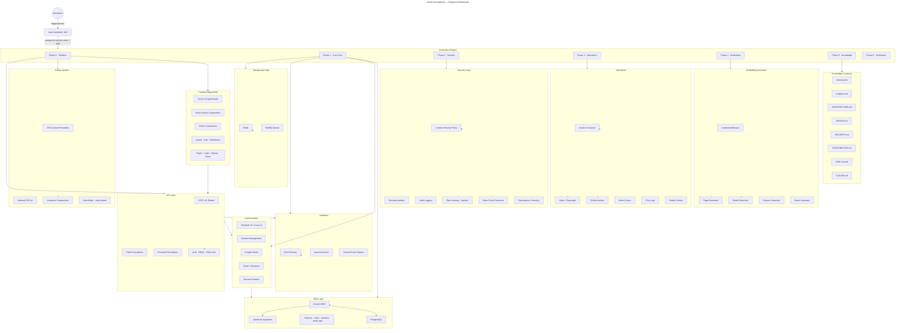
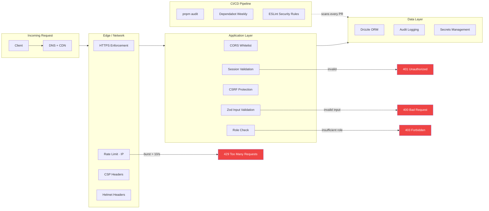

# SaaS Foundation

> The world's best full-stack TypeScript SaaS foundation — scaffolded, secured, and documented in one command.

[](LICENSE.md)
[](https://github.com/srksourabh/saas-foundation)

**saas-foundation** is a Claude Code skill (compatible with any AI agent tool that supports Claude skills) that generates a complete, production-grade TypeScript SaaS starter project from scratch. It is not a template you clone — it is an **intelligent scaffolder** that asks two questions, then builds the entire project for you.

When invoked, it creates your project in seconds, not hours.

---

## Table of Contents

- [What it generates](#what-it-generates)
- [Architecture](#architecture)
- [How the skill works](#how-the-skill-works)
  - [What it looks for (triggers)](#what-it-looks-for-triggers)
  - [Pre-flight questions](#pre-flight-questions)
  - [Generation process (6 phases)](#generation-process-6-phases)
- [Component inventory](#component-inventory)
  - [Core files](#core-files)
  - [Templates (project output)](#templates-project-output)
  - [Reference docs](#reference-docs)
  - [Scaffolding scripts](#scaffolding-scripts)
- [Installation](#installation)
  - [Quick install (one-command)](#quick-install-one-command)
  - [Claude Code CLI](#claude-code-cli)
  - [Manual installation](#manual-installation)
  - [OpenClaw](#openclaw)
  - [Cursor](#cursor)
  - [VS Code (Claude extension)](#vs-code-claude-extension)
  - [Windsurf](#windsurf)
- [Usage](#usage)
- [What each template produces](#what-each-template-produces)
- [Extending the foundation](#extending-the-foundation)
- [Stack decisions](#stack-decisions)
- [Security model](#security-model)
- [License](#license)

---

## What it generates

```
<project-name>/
├── apps/
│   └── web/                    # Next.js 16 (App Router)
│       ├── app/
│       │   ├── (auth)/         # Login, signup pages
│       │   ├── (dashboard)/    # Authenticated shell
│       │   ├── api/            # tRPC handler, auth handler
│       │   ├── layout.tsx      # Root layout with providers
│       │   └── page.tsx        # Landing page
│       ├── components/         # UI components
│       ├── trpc/               # tRPC router definitions
│       ├── e2e/                # Playwright tests
│       └── middleware.ts       # Security headers, rate limiting
├── packages/
│   ├── ui/                     # shadcn/ui components
│   ├── db/                     # Drizzle schema + migrations
│   ├── auth/                   # Auth configuration
│   ├── validators/             # Zod validation schemas
│   ├── email/                  # React Email templates
│   └── config/                 # Env vars, constants, errors, logger
├── tooling/
│   ├── eslint/                 # Shared ESLint flat config
│   └── typescript/             # Shared tsconfig bases
├── scripts/                    # Scaffolding CLI
├── .github/workflows/          # CI/CD pipelines
├── docker/
│   ├── Dockerfile
│   └── docker-compose.yml      # Postgres + Redis + app
├── docs/
│   ├── memory.md               # Session-level context
│   ├── progress.md             # Milestone tracking
│   ├── ARCHITECTURE.md         # System design
│   ├── DESIGN.md               # Design system tokens
│   ├── SECURITY.md             # Security model
│   ├── CONTRIBUTING.md         # Contributor guide
│   └── ADR/                    # Architecture Decision Records
├── CLAUDE.md                   # Per-project AI instructions
├── .env.example                # Environment variable template
├── .gitignore
├── package.json                # pnpm workspace root
├── pnpm-workspace.yaml
├── turbo.json
├── tsconfig.json
├── vitest.workspace.ts
└── playwright.config.ts
```

---

## Architecture



---

## How the skill works

### What it looks for (triggers)

The skill auto-fires when you say any of these phrases:

| Trigger phrase | Example |
|----------------|---------|
| Create a new project | "create a new project called acme" |
| Start a new SaaS | "start a new SaaS called myapp" |
| Scaffold a project | "scaffold a full-stack TypeScript SaaS" |
| Project foundation | "use the project foundation" |
| World's best foundation | "use the world's best foundation" |
| Build a new app | "build a new app with auth and DB" |
| Initialize foundation | "initialize foundation for my startup" |
| New full-stack project | "new full-stack project with monorepo" |
| Start a monorepo | "start a monorepo project" |

### Pre-flight questions

Before generating, the skill asks exactly **2 questions**:

1. **Project name** — kebab-case, e.g., `my-saas`
2. **Auth provider** — NextAuth v5 (simpler, more OAuth providers) or Lucia v3 (more flexible, lower-level)

If you say "surprise me" or "your call", it defaults to NextAuth v5.

### Generation process (6 phases)

| Phase | What happens | Output |
|-------|-------------|--------|
| **0 — Skeleton** | Creates directory structure, root configs (turborepo, pnpm, tsconfig, vitest, playwright) | ~60 directories, ~20 config files |
| **1 — Core infra** | Drizzle schema (users/sessions/audit_logs), auth, Zod validators, tRPC router, Next.js pages, Docker Compose, design system, shadcn/ui | ~80 files across all packages |
| **2 — Security** | CSP + Helmet headers, CORS, rate limiting, RBAC middleware, audit logging, brute force protection, password policy | middleware.ts, config, audit schema |
| **3 — Operations** | Vitest tests, Playwright E2E, Pino logging, Sentry integration, health checks, CI/CD YAML | ~15 test files, CI pipeline |
| **4 — Scaffolding** | CLI scripts for generating models, pages, features, and emails | scripts/scaffold.ps1 |
| **5 — Knowledge** | All documentation files written from templates with project name injected | 8 files (CLAUDE.md, memory.md, progress.md, ARCHITECTURE.md, DESIGN.md, SECURITY.md, CONTRIBUTING.md, ADR/adr-template.md) |
| **6 — Verification** | 11-point checklist: install, lint, typecheck, test, docker build, health endpoint, auth flow | Pass/fail on each check |

---

## Component inventory

### Core files

| File | Purpose |
|------|---------|
| `SKILL.md` | Main skill definition — 406 lines of instructions covering 6 execution phases, anti-patterns, output format, and scope boundary. This is what the AI agent reads when the skill is invoked. |
| `skills.sh` | One-command installer — auto-detects Claude Code, OpenClaw, Cursor, Windsurf, and VS Code Claude extension, installs the skill into each, and verifies. |
| `LICENSE.md` | MIT License — full terms for open-source use, modification, and distribution. |
| `.gitignore` | Excludes `node_modules/`, `.DS_Store`, `Thumbs.db`, and `*.log`. |

### Templates (project output)

These are the files the skill writes **into your generated project**. Each template contains `<placeholders>` that get replaced with your project name, auth provider, and current year.

#### Knowledge continuity

| Template | Generates in project | Purpose |
|----------|---------------------|---------|
| `templates/CLAUDE.md` | `CLAUDE.md` | Per-project AI instructions. Tells the AI agent the stack, conventions, commands, and security rules for that specific project. Ensures every AI session has the correct context. |
| `templates/memory.md` | `docs/memory.md` | Session-level context store. Records project metadata, architecture decisions (with ADR links), key dependencies, session notes (date-stamped), known issues, and environment details (dev/staging/prod). Updated each session. |
| `templates/progress.md` | `docs/progress.md` | Milestone tracker. Contains Phase 0-6 checklists (all marked pending on creation), a completed log table, and a blockers table. Serves as the single source of truth for what's done and what's next. |
| `templates/ARCHITECTURE.md` | `docs/ARCHITECTURE.md` | System architecture document. Includes ASCII system overview diagram, request flow explanation, data model definitions (users, sessions, audit_logs), security boundary table, and package dependency graph. |
| `templates/DESIGN.md` | `docs/DESIGN.md` | Complete design system specification. Brand palette (50-900 scale), semantic colors (light + dark), typography (type scale with Inter + JetBrains Mono), spacing scale, border radius tokens, shadow tokens, motion tokens, layout system (sidebar + main + breakpoints), component tier architecture (primitives → composed → feature), state patterns (loading/empty/error/edge), form patterns (react-hook-form + Zod), accessibility baseline (WCAG AA), dark mode implementation, iconography conventions, and coding conventions for UI. |
| `templates/SECURITY.md` | `docs/SECURITY.md` | Security model document. Covers authentication method, RBAC roles, rate limits, CSP/Helmet headers, data protection (SQL injection, XSS, secrets), audit logging policy, dependency security, and incident response procedures. |
| `templates/CONTRIBUTING.md` | `docs/CONTRIBUTING.md` | Onboarding and contribution guide. Step-by-step setup instructions, development workflow (branch → code → test → lint → typecheck → build → commit → PR), code conventions (naming, imports, exports), testing conventions, and a pull request checklist. |
| `templates/ADR-template.md` | `docs/ADR/adr-template.md` | Architecture Decision Record template. Each ADR captures: date, status (Proposed/Accepted/Deprecated/Superseded), context, decision, rationale, trade-offs, and consequences. Promotes "decisions are documented" culture from day one. |

#### Configuration

| Template | Generates in project | Purpose |
|----------|---------------------|---------|
| `templates/.env.example` | `.env.example` | Environment variable stencil. Documents every env var required: database URL, auth secret, OAuth credentials, Redis URL, Resend API key, Upstash credentials, Sentry DSN, and app URL. All values are placeholders — no real secrets. |

### Reference docs

These live in the skill itself and guide the AI agent during generation:

| File | Purpose |
|------|---------|
| `reference/stack.md` | Technology choice rationale. Explains why each library was chosen vs alternatives (e.g., Turborepo over Nx, Drizzle over Prisma, Vitest over Jest). Includes "when to swap" guidance for serverless DB, file uploads, real-time, AI features, and multi-tenancy. |
| `reference/project-structure.md` | Directory tree reference with every file enumerated. Includes the package alias map (`@ui`, `@db`, `@auth`, `@validators`, `@email`, `@config`) showing how imports resolve across the monorepo. |
| `reference/design-guide.md` | Front-end design implementation roadmap. Provides step-by-step generation order: globals CSS → Tailwind config → shadcn/ui init → layout components → page layouts → responsive behavior. Includes DataTable and form page composition patterns with code examples. Documents 8 anti-patterns the agent must avoid. |
| `reference/security-checklist.md` | 45-point security hardening checklist organized by category: auth (7 checks), API (6 checks), HTTP headers (6 checks), database (4 checks), secrets (4 checks), monitoring (5 checks). Each check is represented as a `[ ]` checkbox the agent ticks during Phase 2. |

### Scaffolding scripts

| File | Purpose |
|------|---------|
| `scripts/scaffold.ps1` | PowerShell scaffolding CLI that gets copied into the generated project as `scripts/scaffold.ps1`. Supports four commands via `pnpm scaffold`: |

| Command | Generates |
|---------|-----------|
| `pnpm scaffold model <name>` | Drizzle schema file, Zod validator (create + update schemas), and tRPC CRUD router (list/getById/create/update/delete) |
| `pnpm scaffold page <name>` | Next.js page (`page.tsx`), error boundary (`error.tsx`), and loading state (`loading.tsx`) |
| `pnpm scaffold feature <name>` | Full vertical slice: model + page + API + tests |
| `pnpm scaffold email <name>` | React Email template file |

---

## Installation

### Quick install (one-command)

```bash
curl -fsSL https://raw.githubusercontent.com/srksourabh/saas-foundation/main/skills.sh | bash
```

This auto-detects your installed AI tools and installs the skill into each one.

### Claude Code CLI

```bash
# Clone directly into Claude Code skills directory
git clone https://github.com/srksourabh/saas-foundation ~/.claude/skills/saas-foundation

# Or add as a submodule if your skills directory is a repo
cd ~/.claude/skills
git submodule add https://github.com/srksourabh/saas-foundation
```

### Manual installation

```bash
# Download the ZIP
curl -fsSL https://github.com/srksourabh/saas-foundation/archive/refs/heads/main.zip -o saas-foundation.zip
unzip saas-foundation.zip
mv saas-foundation-main ~/.claude/skills/saas-foundation
rm saas-foundation.zip
```

### OpenClaw

OpenClaw runs skills from `~/.openclaw/skills/` (mounted via Docker volume in `openclaw-docker/docker-compose.yml`).

```bash
# 1. Create the skills directory
mkdir -p ~/.openclaw/skills

# 2. Install the skill
git clone https://github.com/srksourabh/saas-foundation ~/.openclaw/skills/saas-foundation

# 3. Set the environment variable (if not already set)
echo "OPENCLAW_SKILLS_DIR=$HOME/.openclaw/skills" >> ~/.openclaw/.env

# 4. Restart the OpenClaw container
cd ~/openclaw-docker
docker compose restart
```

OpenClaw also supports the `.claude/skills/` directory if mounted at `/home/node/.claude/skills` inside the container. The `skills.sh` installer handles both paths.

### Cursor

Cursor supports Claude-compatible skills at `~/.cursor/claude/skills/`:

```bash
mkdir -p ~/.cursor/claude/skills
git clone https://github.com/srksourabh/saas-foundation ~/.cursor/claude/skills/saas-foundation
```

### VS Code (Claude extension)

The Claude extension for VS Code reads skills from `~/.vscode/claude/skills/`:

```bash
mkdir -p ~/.vscode/claude/skills
git clone https://github.com/srksourabh/saas-foundation ~/.vscode/claude/skills/saas-foundation
```

### Windsurf

```bash
mkdir -p ~/.windsurf/claude/skills
git clone https://github.com/srksourabh/saas-foundation ~/.windsurf/claude/skills/saas-foundation
```

---

## Usage

Once installed, open your AI agent tool and use one of the trigger phrases:

```
create a new project called my-saas
```

The agent will:
1. Ask for your project name and auth provider preference
2. Generate the entire project structure
3. Write every file from templates
4. Run verification checks
5. Return a summary with next steps

### Example session

```
You:  create a new project called acme
Agent: Two questions:
       1. Project name: acme (pre-filled)
       2. Auth provider: NextAuth v5 or Lucia v3?
You:  NextAuth v5
Agent: [generates project... returns:]

      ## Project created: acme

      ### Structure
      - 42 directories, 127 files

      ### Stack
      - Frontend: Next.js 16 + Tailwind + shadcn/ui
      - Design system: token-based, Inter + JetBrains Mono, WCAG AA
      - Backend: tRPC + Drizzle ORM + PostgreSQL
      - Auth: NextAuth v5 (Google + email/password)
      - Queue: BullMQ + Redis
      - Test: Vitest + Playwright
      - CI: GitHub Actions

      ### Quick start
      pnpm install
      cp .env.example .env   # fill in values
      docker compose up -d
      pnpm db:push
      pnpm dev
```

---

## What each template produces

### CLAUDE.md (per-project AI instructions)

When the AI returns to work on your new project, it reads `CLAUDE.md` to get:
- The exact stack (so it doesn't guess)
- All available commands (dev, build, test, db operations)
- The directory structure (so it knows where files live)
- Convention rules (naming, imports, testing)
- Security rules it must follow

This means every session starts with full context — no repeated "what stack are we using?" questions.

### memory.md (session context)

The memory file is structured so both humans and AI can read it:
- **Project metadata**: creation date, stack, auth method, deployment targets
- **Architecture decisions**: ADR entries with date, decision, reason, and trade-offs
- **Key dependencies**: list with brief descriptions
- **Session notes**: date-stamped entries recording what was worked on, decisions made, files touched, and current state
- **Known issues**: bug tracker and pending decisions
- **Environment**: dev/staging/prod URLs and notes

### progress.md (milestone tracking)

- **Phase 0-6 checklists**: every step required to complete the foundation, all initially marked pending
- **Completed table**: date, milestone, and notes for each completed phase
- **Blockers table**: what's blocked, why, and current status

### ARCHITECTURE.md (system design)

- ASCII system diagram showing Next.js → tRPC → Drizzle → PostgreSQL → Redis flow
- Step-by-step request flow explanation
- Data model definitions for users, sessions, and audit_logs
- Security boundary table (network → transport → application → auth → data)
- Package dependency graph

### DESIGN.md (design system)

- Brand palette with token names and hex values
- Semantic colors for light and dark mode (background, text, border, success/warning/error/info)
- Complete type scale (display through caption) with font stack, weights, and line heights
- Spacing scale (0 to 24, rem and px values)
- Border radius tokens (sm through full)
- Shadow tokens for light and dark mode
- Motion tokens (duration and easing) with `prefers-reduced-motion` support
- Layout system with breakpoints, grid rules, and page layout diagram
- Three-tier component architecture (shadcn primitives → composed → feature)
- State patterns for loading, empty, error, and edge cases
- Form patterns using react-hook-form + Zod + shadcn/ui
- Accessibility baseline meeting WCAG AA
- Dark mode implementation (class-based, localStorage)
- Iconography conventions (lucide-react)
- Coding conventions (naming, exports, CVA, cn() utility)

### SECURITY.md (security model)

- Authentication method, providers, password policy, session rotation, brute force protection
- RBAC roles and enforcement
- API rate limiting, input validation, CORS, headers
- Data protection (SQL injection, XSS, secrets, password hashing)
- Audit logging (what gets logged, when)
- Dependency security (pnpm audit, Dependabot)
- Incident response (Sentry, rate limit alerts, audit review)

### CONTRIBUTING.md (contributor guide)

- Step-by-step setup from `git clone` to `pnpm dev`
- 8-step development workflow
- Code conventions (naming, imports, exports)
- Testing conventions (unit, integration, E2E, hermetic tests)
- 7-point pull request checklist

### ADR/adr-template.md (decision records)

- Date, status, context, decision, rationale, trade-offs, and consequences
- Encourages documenting every architectural decision as it's made

### .env.example (environment configuration)

- Database URL (PostgreSQL)
- Auth secret + Google OAuth credentials
- Redis URL (for queue + rate limiting)
- Resend API key (email)
- Upstash Redis credentials (rate limiting)
- Sentry DSN (error monitoring)
- App URL + Node environment

---

## Extending the foundation

The foundation is deliberately minimal — it gives you the solid base without domain logic. Here's how to extend it:

| Need | How |
|------|-----|
| **New feature** | `pnpm scaffold feature <name>` (generates schema + validator + router + page) |
| **Custom domain model** | `pnpm scaffold model <name>` then edit `packages/db/src/schema/<name>.ts` |
| **Background job** | Add to `packages/queue/` with BullMQ worker |
| **Email template** | `pnpm scaffold email <name>` then edit in `packages/email/src/templates/` |
| **API endpoint** | Add a tRPC procedure to an existing router or create a new router |
| **UI component** | Add to `packages/ui/src/ui/` if reusable, or `apps/web/components/` if feature-specific |
| **Third-party integration** | Add a new `packages/<integration>/` with its own Drizzle schemas and tRPC routers |

---

## Stack decisions

Every technology in this foundation was chosen deliberately. The full rationale is in `reference/stack.md`, but the headline comparisons:

| This | Not this | Why |
|------|----------|-----|
| **Turborepo** | Nx | Lighter, faster, Vercel-native |
| **pnpm** | npm/yarn | Content-addressable store, strict deps |
| **Next.js 16** | Remix | Larger ecosystem, RSC out of box |
| **tRPC** | REST/GraphQL | End-to-end type safety, zero schema duplication |
| **Drizzle** | Prisma | No engine binary, SQL-like API, faster CI |
| **Tailwind v4** | CSS modules | CSS-first config, utility-first |
| **shadcn/ui** | MUI/Chakra | Copy-paste model, Radix-based, no lock-in |
| **Vitest** | Jest | esbuild-native, ESM-first |
| **Playwright** | Cypress | Faster, auto-wait, multi-browser |
| **NextAuth/Lucia** | Clerk/Auth0 | Self-hosted, no vendor lock-in |
| **BullMQ** | Sidekiq | Redis-native, TypeScript-first |
| **Pino** | Winston | 10x faster, JSON-native |
| **Sentry** | Datadog | Free tier, excellent Next.js integration |
| **Resend** | SendGrid | Modern API, React Email templates |

---

## Security model

Security is not optional in this foundation. Every protection below is built in during Phase 2:



---

## License

[MIT](LICENSE.md) — Use it, modify it, ship it. No strings attached.

---

## Repository

**GitHub**: [github.com/srksourabh/saas-foundation](https://github.com/srksourabh/saas-foundation)

Created by [Sourabh Bhaumik](https://github.com/srksourabh).
