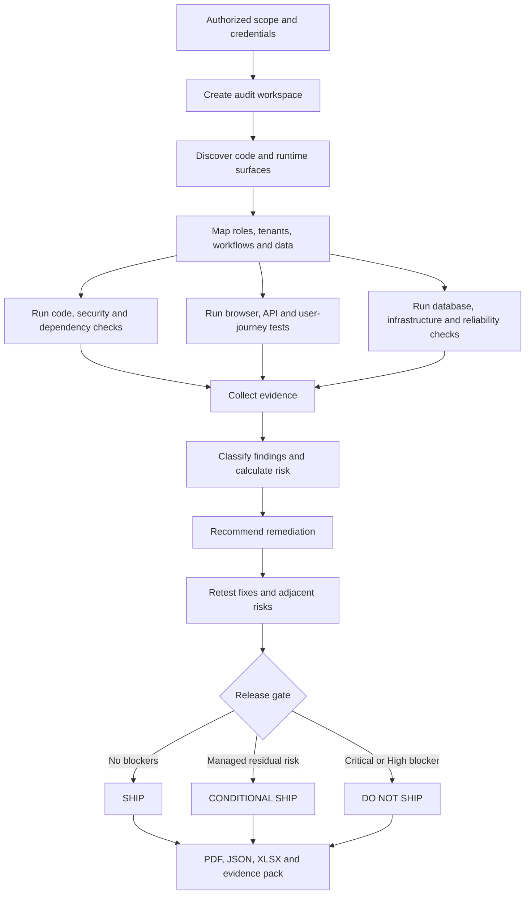
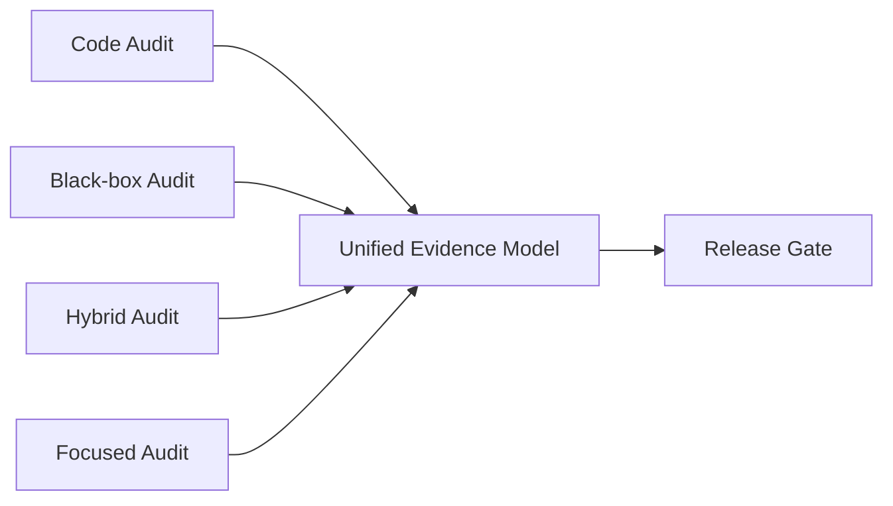
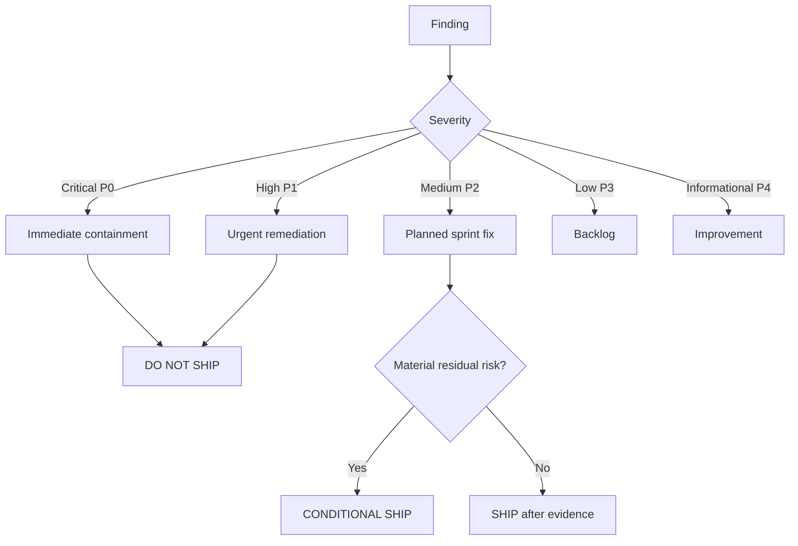
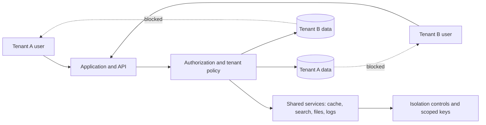

# Saas-audit

> A portable Agent Skill for exhaustive, evidence-driven SaaS auditing and pre-release assurance.

[](../LICENSE.md)
[](SKILL.md)
[](https://linkedin.com/in/srksourabh)

`saas-audit` turns Claude Code, Codex, Hermes, Anti-Gravity, VS Code/Copilot-compatible agents, and other Agent Skills clients into a structured SaaS release-assurance team. It audits source code and deployed applications, captures evidence, scores findings, proposes fixes, retests remediation, and produces a final `SHIP`, `CONDITIONAL SHIP`, or `DO NOT SHIP` recommendation.

It is designed for authorized testing only. It does not perform destructive exploitation, uncontrolled load testing, credential stuffing, data exfiltration, or production changes without explicit approval.

## Why this skill exists

SaaS failures rarely come from one isolated bug. They usually emerge from combinations of weak authorization, missing tenant isolation, stale database logic, unsafe migrations, poor error handling, accessibility barriers, slow workflows, hidden operational risks, and incomplete release evidence.

`saas-audit` addresses that problem by forcing a single, evidence-backed review across product, engineering, security, data, infrastructure, usability, and release operations.

## Core benefits

- **One audit model across tools** — use the same workflow in Claude Code, Codex, Hermes, Anti-Gravity, VS Code and compatible agents.
- **Pre-release confidence** — obtain an explicit release verdict instead of an unstructured list of observations.
- **Tenant protection** — test whether one tenant can discover another tenant's name, users, files, branding, metadata, reports or configuration.
- **Server-side RBAC verification** — validate API and route authorization, not merely hidden buttons.
- **Evidence-first reporting** — every confirmed finding requires reproducible evidence, severity, business impact and remediation.
- **Full-stack coverage** — code, UI, UX, APIs, database, storage, cache, infrastructure, CI/CD, dependencies and observability.
- **Reusable outputs** — PDF/HTML report, JSON findings, RBAC matrix, screenshots, coverage ledger and execution log.
- **Safe by default** — destructive or uncontrolled tests are prohibited.

## Audit workflow



## Audit domains

| Domain | What is checked |
|---|---|
| Discovery | Routes, modules, APIs, roles, tenants, workflows, jobs, webhooks, storage, integrations and hidden surfaces |
| Authentication | Login, password reset, MFA, session lifecycle, cookies, token storage, logout and revocation |
| RBAC | Role inventory, permission matrix, direct-route access, API enforcement and privilege escalation |
| Multi-tenancy | Cross-tenant records, names, metadata, files, reports, notifications, cache, logs, search and exports |
| Functional QA | Forms, CRUD, imports, exports, workflows, validation, duplicates, interruptions and recovery |
| UI/UX | Navigation, clarity, visual consistency, responsive layouts, states, cognitive load and usability |
| Accessibility | Keyboard operation, focus, semantic structure, labels, contrast, zoom, ARIA and WCAG 2.2 readiness |
| Application security | Injection, XSS, CSRF, SSRF indicators, headers, TLS, disclosure, upload security and business logic |
| API security | Authentication, object/function authorization, schema validation, rate limits, CORS, replay and idempotency |
| Database and storage | Integrity, constraints, tenant scoping, RLS, migrations, backups, buckets, encryption and retention |
| Supply chain | Dependencies, SBOM, licenses, secrets, package provenance and vulnerable libraries |
| Infrastructure | CI/CD, cloud configuration, IaC, containers, environment separation, rollback and secret management |
| Reliability | Retries, queues, cron, webhooks, concurrency, race conditions, stale updates, backup restore and DR |
| Performance | Page load, API latency, slow queries, large bundles, duplicate requests, search, exports and uploads |
| Privacy | Data minimization, retention, deletion, masking, consent, logs, exports and third-party processing |
| AI/LLM | Prompt injection, tool permissions, RAG isolation, vector-store leakage, unsafe rendering and memory separation |
| Reporting | Severity matrix, risk heat map, evidence index, roadmap, residual risk and final release verdict |

See [Detailed Features](docs/FEATURES.md).

## Operating modes



1. **Code audit** — repository, architecture, tests, dependencies, migrations, infrastructure and CI/CD.
2. **Black-box audit** — deployed application through browser and APIs using authorized test accounts.
3. **Hybrid audit** — correlates source code, database, API, logs and runtime behavior. Recommended.
4. **Release gate** — final pre-production assessment with retesting and verdict.
5. **Focused audit** — one module or workflow, while preserving its security, data, RBAC and regression boundaries.

## Quick installation

### macOS, Linux, WSL or Git Bash

```bash
cd saas-foundation/saas-audit
./install.sh
```

Project-level installation:

```bash
./install.sh --project
```

### Windows PowerShell

```powershell
cd saas-foundation\saas-audit
.\install.ps1
```

Project-level installation:

```powershell
.\install.ps1 -Project
```

For complete tool-specific instructions, read [Installation Guide](docs/INSTALLATION.md).

## Basic usage

```text
Use the saas-audit skill to perform a complete hybrid pre-release audit of this repository and the staging application.

Audit source code, authentication, RBAC, tenant isolation, database, APIs, security, UI/UX, accessibility, performance, infrastructure, CI/CD, dependencies, privacy, reliability and critical user journeys.

Use two tenants and all available roles. Capture screenshots and technical evidence. Generate the PDF, JSON, XLSX, RBAC matrix, evidence folder, execution log and final SHIP, CONDITIONAL SHIP or DO NOT SHIP verdict.
```

More examples: [Usage Guide](docs/USAGE.md).

## Expected output

```text
saas-audit-output/
├── reports/
│   ├── <app>_Holistic_SaaS_Audit_Report_<date>.pdf
│   ├── <app>_Holistic_SaaS_Audit_Report_<date>.html
│   └── <app>_Release_Verdict_<date>.md
├── data/
│   ├── <app>_Audit_Findings_<date>.json
│   ├── <app>_Detailed_Audit_Findings_<date>.xlsx
│   ├── <app>_RBAC_Matrix_<date>.xlsx
│   ├── coverage.json
│   └── evidence-index.json
├── evidence/<domain>/
├── logs/<app>_Audit_Execution_Log_<date>.md
└── manifest.json
```

See [Evidence and Reporting](docs/REPORTING.md).

## Severity and release gates



Default `DO NOT SHIP` conditions include unresolved Critical or High security issues, authentication or authorization bypass, tenant leakage, exposed secrets, failed critical tests, unsafe migrations, missing rollback for material changes, or untested critical workflows.

## Multi-tenant isolation model



The audit checks both direct data access and indirect disclosure through autocomplete, errors, exports, filenames, notifications, analytics, webhooks, logs, cache keys, CDN paths and branding metadata.

## Repository map

```text
saas-audit/
├── SKILL.md
├── README.md
├── install.sh
├── install.ps1
├── assets/
│   └── finding.schema.json
├── scripts/
│   ├── init_audit.py
│   ├── validate_findings.py
│   └── render_report.py
├── references/
│   ├── execution-playbook.md
│   ├── security-rbac-tenancy.md
│   ├── quality-ux-accessibility.md
│   ├── data-api-infrastructure.md
│   ├── evidence-reporting-release.md
│   ├── master-audit-checklist.md
│   └── platform-installation.md
└── docs/
    ├── FEATURES.md
    ├── ARCHITECTURE.md
    ├── INSTALLATION.md
    ├── USAGE.md
    ├── REPORTING.md
    ├── TROUBLESHOOTING.md
    └── CONTRIBUTING.md
```

## Documentation index

- [Detailed Features](docs/FEATURES.md)
- [Architecture and Workflow](docs/ARCHITECTURE.md)
- [Installation Guide](docs/INSTALLATION.md)
- [Usage Guide and Prompt Examples](docs/USAGE.md)
- [Evidence, Severity and Reporting](docs/REPORTING.md)
- [Troubleshooting](docs/TROUBLESHOOTING.md)
- [Contributing](docs/CONTRIBUTING.md)
- [Core Skill Instructions](SKILL.md)
- [Master Audit Checklist](references/master-audit-checklist.md)

## Safety and authorization

Use only on applications, repositories and infrastructure you are authorized to test. Never commit credentials. Prefer environment variables or ignored local secret files. Review scripts before granting terminal, browser, cloud or database access.

## Limitations

The skill improves audit consistency but does not replace independent professional penetration testing, legal advice, formal compliance certification, production-owner approval, or human release accountability. Actual coverage depends on available credentials, environments, browser tools, source access and infrastructure permissions.

## License

MIT. Prepared by **Sourabh Bhaumik**.
