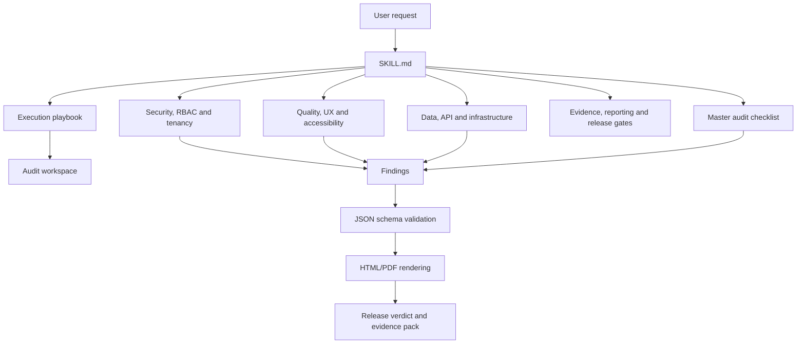
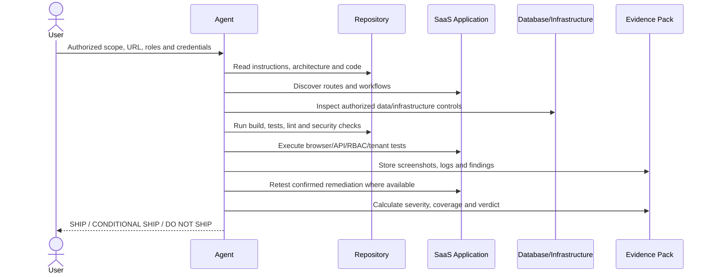
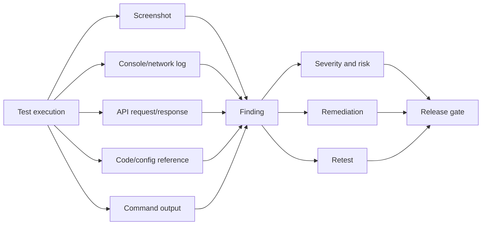

# Architecture and Workflow

## Skill architecture

`saas-audit` is intentionally split into a compact core instruction file and progressive reference modules. This allows compatible agents to load only the detail needed for the current audit phase.

## Audit control flow

## Evidence model

## Trust boundaries

The audit treats the following as distinct trust boundaries:

- anonymous visitor to authenticated application;
- one user to another user;
- lower role to privileged role;
- one tenant to another tenant;
- browser to API;
- API to database and storage;
- application to third-party service;
- CI/CD to production;
- human instruction to AI agent;
- model output to tool execution;
- untrusted document to RAG/vector memory.

## Status model

Each test or finding is classified as:

- `PASS` — test executed and expected behavior observed;
- `FAIL` — test executed and defect confirmed;
- `BLOCKED` — required access, data or tool unavailable;
- `NOT TESTED` — outside scope or intentionally skipped with reason;
- `NOT APPLICABLE` — feature does not exist;
- `CONFIRMED`, `PROBABLE`, `OBSERVATION` or `FALSE POSITIVE` for finding confidence.

## Design principles

1. Evidence before claims.
2. Server-side enforcement before UI assumptions.
3. Tenant isolation across every shared subsystem.
4. Safe, non-destructive validation.
5. Coverage limitations remain visible.
6. Critical and High findings block release by default.
7. Human release authorization remains mandatory.
