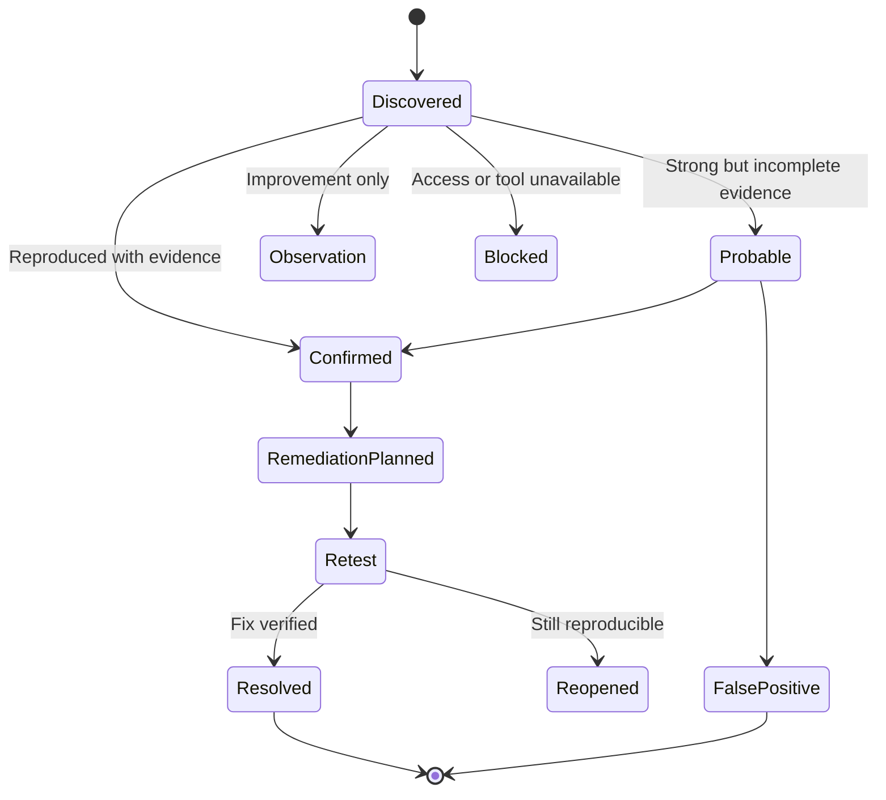
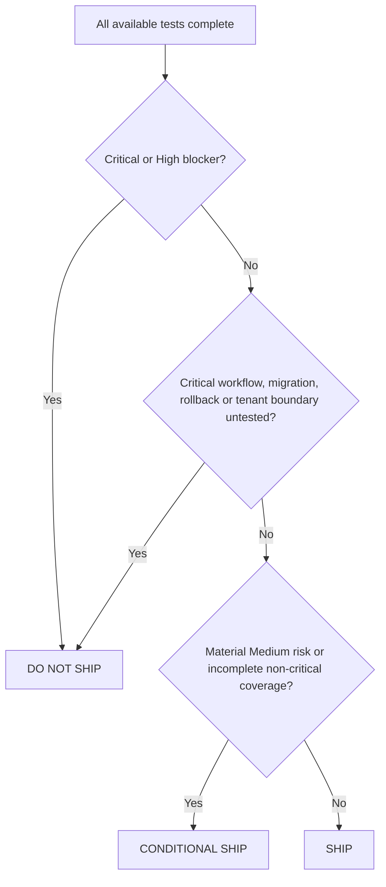

# Evidence, Severity and Reporting

## Evidence requirements

Every confirmed finding should reference one or more of:

- full-page or focused screenshot;
- browser console or network log;
- API request and sanitized response;
- code, configuration or migration reference;
- command output or test result;
- database or infrastructure evidence obtained through authorized access.

Evidence must record issue ID, role, tenant, page or endpoint, environment, timestamp, viewport where relevant, and build or commit identifier. Secrets and sensitive data must be redacted.

## Finding lifecycle



## Severity model

| Severity | Priority | Typical examples | Default action |
|---|---|---|---|
| Critical | P0 | Authentication bypass, cross-tenant data exposure, exposed production secrets, remote code execution | Immediate containment; block release |
| High | P1 | Major RBAC failure, sensitive data exposure, stored XSS, unauthorized modification | Urgent fix; block release by default |
| Medium | P2 | Weak session control, important workflow defect, significant accessibility or performance issue | Fix in planned sprint; assess residual risk |
| Low | P3 | Minor validation, cosmetic, low-risk disclosure or usability issue | Backlog |
| Informational | P4 | Hardening, documentation or design improvement | Consider during improvement cycle |

## Risk score

Recommended calculation:

```text
Risk Score = Likelihood × max(Technical Impact, Business Impact, User Impact)
```

Each factor is scored from 1 to 5.

- 20–25: Critical
- 15–19: High
- 8–14: Medium
- 3–7: Low
- 1–2: Informational

Professional judgment may override the number when justified and documented.

## Release verdict



A production owner must still authorize release.

## Required report sections

1. Cover and confidentiality notice
2. Document control
3. Executive summary
4. Scope, exclusions and limitations
5. Methodology and tools
6. Application and architecture overview
7. Surface inventory and sitemap
8. Role and tenant inventory
9. RBAC matrix
10. User-journey analysis
11. Domain scorecards
12. Severity distribution and risk heat map
13. Prioritized findings
14. Detailed findings with evidence
15. Remediation roadmap
16. Retest results and residual risk
17. Coverage metrics
18. Final release verdict
19. Appendices and execution log

## Remediation roadmap

- **Immediate, 0–48 hours:** active exposure, tenant leakage, auth bypass, exposed secrets.
- **Urgent, 3–7 days:** High findings, serious data-integrity or RBAC failures.
- **Short term, 1–4 weeks:** Medium issues, major UX/accessibility/performance gaps, missing regression tests.
- **Medium term, 1–3 months:** architecture, observability, design system, compliance process and technical-debt improvements.

Each action should specify owner, effort, dependencies, risk reduction, validation method and target date or sprint.

## Coverage reporting

The report must include pages, roles, tenants, workflows, forms, APIs, tests, screenshots, passed, failed, blocked, skipped and not-applicable counts. Never claim 100% coverage unless every declared surface was actually tested.
